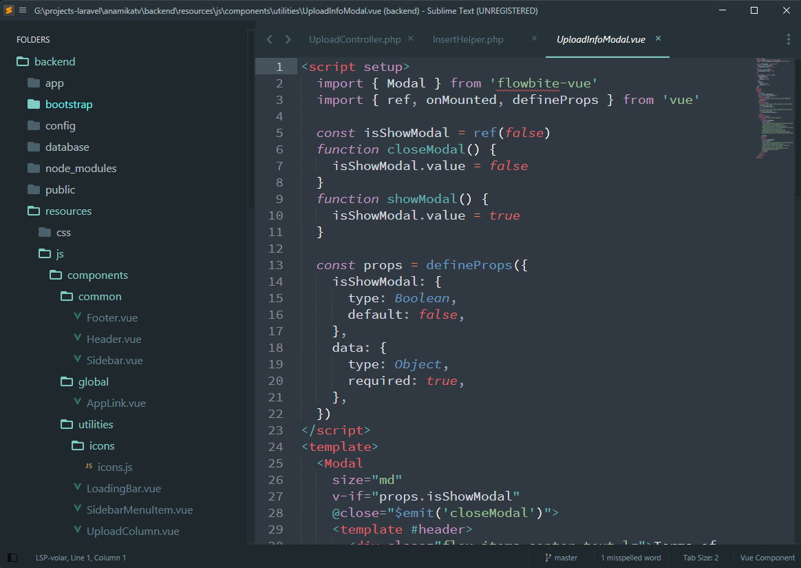

# Laravel-Blog

<p>My IDE setup backup</p>

## Sublime Text setup

### Preview



### Setup on sublime text 4

```
1. Download sublime dir

2. Open sublime and press Ctrl+Shift+P or Go to Preference > Brows Packages

3. Delete User directory & Past  User & Material Theme folder

4. Restart sublime text, If you don't have package manager then install sublime package manager

5. Wait for few minutes, it will download all required extension and setting on your IDE
```

## Author Info

<h3>Biplob Shaha</h3>
- <a href="https://facebook.com/devbipu">Facebook</a><br>
- <a href="https://github.com/devbipu">Github</a><br>
- <a href="https://linkedin.com/in/devbipu">Linkedin</a><br>
